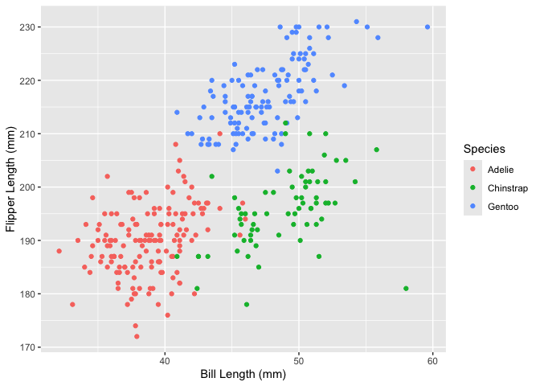

p8105_hw1_hl3464
================
Hongtong Lin
2026-09-22

## Load Libraries

``` r
library(palmerpenguins)
library(ggplot2)
```

## Problem 1

``` r
data("penguins", package = "palmerpenguins") 
penguins # briefly read the data
```

    ## # A tibble: 344 × 8
    ##    species island    bill_length_mm bill_depth_mm flipper_length_mm body_mass_g
    ##    <fct>   <fct>              <dbl>         <dbl>             <int>       <int>
    ##  1 Adelie  Torgersen           39.1          18.7               181        3750
    ##  2 Adelie  Torgersen           39.5          17.4               186        3800
    ##  3 Adelie  Torgersen           40.3          18                 195        3250
    ##  4 Adelie  Torgersen           NA            NA                  NA          NA
    ##  5 Adelie  Torgersen           36.7          19.3               193        3450
    ##  6 Adelie  Torgersen           39.3          20.6               190        3650
    ##  7 Adelie  Torgersen           38.9          17.8               181        3625
    ##  8 Adelie  Torgersen           39.2          19.6               195        4675
    ##  9 Adelie  Torgersen           34.1          18.1               193        3475
    ## 10 Adelie  Torgersen           42            20.2               190        4250
    ## # ℹ 334 more rows
    ## # ℹ 2 more variables: sex <fct>, year <int>

column names/variable name:

``` r
colnames(penguins)
```

    ## [1] "species"           "island"            "bill_length_mm"   
    ## [4] "bill_depth_mm"     "flipper_length_mm" "body_mass_g"      
    ## [7] "sex"               "year"

``` r
# the column names or variables in this penguins data set are ------
# species, island, bill_length_mm, bill_depth_mm, flipper_length_mm,
# body_mass_g, sex, year 
# ------
```

size of the data frame:

``` r
dim(penguins)  # rows*cols
```

    ## [1] 344   8

``` r
nrow(penguins) # the data set has 344 rows
```

    ## [1] 344

``` r
ncol(penguins) # the data set has 8 columns
```

    ## [1] 8

the mean flipper length:

``` r
mean(penguins$flipper_length_mm, na.rm = T) 
```

    ## [1] 200.9152

``` r
# the mean flipper length is 200.92 mm after removing the 
# missing values (NA) from this column.
```

Make a scatterplot of `flipper_length_mm` (y) vs `bill_length_mm` (x)

``` r
ggplot(
  penguins,
  aes(
    y = flipper_length_mm,
    x = bill_length_mm,
    color = species
  )) +
  labs(
    x = "Bill Length (mm)",
    y = "Flipper Length (mm)",
    color = "Species"
  )+ 
  geom_point()  
```

<!-- -->

``` r
ggsave("p8105_hw1_problem1_scatterplot_20260922.png")
# save the scatterplot as a png file into current directory
```
